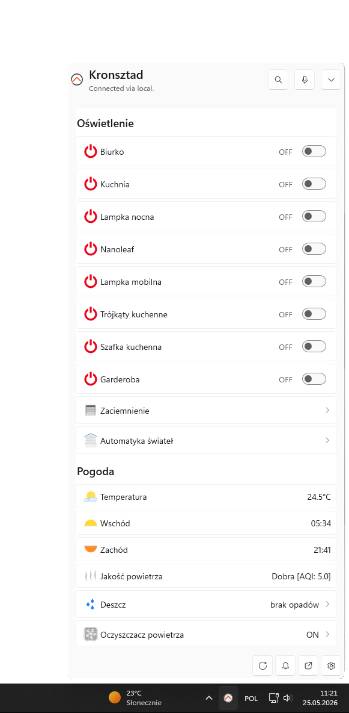

# openHAB Windows Companion App

This repository contains an unofficial Windows companion app for openHAB. The current product direction is a Windows 11 tray app with a compact flyout, a larger main window, embedded openHAB Main UI, and native sitemap rendering for Windows-specific workflows.

## Features

- Windows tray app with compact flyout. 
- Main window with embedded openHAB Main UI through WebView2.
- Optional native sitemap pane backed by the shared sitemap/runtime/rendering pipeline.
- Settings, notifications, startup integration, sitemap navigation, and shortcut command menu work.

For setup and feature usage, see the [App Guide](docs/app-guide.md).

## Code Analysis
The app project is using SonarQube hosted by SonarCloud to analyse the code for issues and code quality.

[](https://sonarcloud.io/dashboard?id=openhab_openhab-windows)

### Quality Status

| Branch | Quality Gate Status | Bugs |Code Smells
|--------|---------------------|------ |------------|
| main | [](https://sonarcloud.io/dashboard?id=reyhard_openhab-win-app)| [](https://sonarcloud.io/dashboard?id=reyhard_openhab-win-app)|[](https://sonarcloud.io/dashboard?id=reyhard_openhab-win-app)|


## Repository Layout

- `src/OpenHab.Core` - endpoint selection, server profiles, HTTP client, credentials, diagnostics, event streams, and device-state mapping.
- `src/OpenHab.Sitemaps` - sitemap models, parsing, normalization, and navigation intents.
- `src/OpenHab.Rendering` - skin-neutral render descriptors and sitemap skin mapping.
- `src/OpenHab.App` - UI-independent settings, runtime controllers, notifications, shell state, and shortcuts.
- `src/OpenHab.Windows.Tray` - WinUI/Windows App SDK shell, tray icon, flyout, main window, settings UI, and Windows-specific rendering.
- `src/OpenHab.Windows.Notifications` - Windows toast notification integration.
- `src/OpenHab.Windows.Package` - MSIX packaging project.
- `tests` - xUnit coverage for core, sitemap, rendering, and app/runtime behavior.
- `docs/superpowers` - design, plan, status, and verification notes used during development.

## Requirements

- Windows 11 for the intended desktop experience.
- .NET SDK version from `global.json`.
- Visual Studio with MSBuild and MSIX/DesktopBridge tooling for package builds.
- WebView2 Runtime for embedded Main UI.

## Build And Test

Everyday direct test gate:

```powershell
dotnet test tests\OpenHab.Core.Tests\OpenHab.Core.Tests.csproj
dotnet test tests\OpenHab.Sitemaps.Tests\OpenHab.Sitemaps.Tests.csproj
dotnet test tests\OpenHab.Rendering.Tests\OpenHab.Rendering.Tests.csproj
dotnet test tests\OpenHab.App.Tests\OpenHab.App.Tests.csproj
```

The direct test projects are the normal logic gate. The package project has DesktopBridge/MSIX prerequisites, so use the package build script for release/package validation.

Build the tray app:

```powershell
dotnet build src\OpenHab.Windows.Tray\OpenHab.Windows.Tray.csproj --configuration Release
```

Build the MSIX package when Visual Studio MSIX/DesktopBridge targets are installed:

```powershell
.\build-package.ps1 -Configuration Release -Platform x64
```

The package project imports DesktopBridge targets that are not always available through standalone .NET SDK MSBuild. Use `build-package.ps1` for package builds because it locates Visual Studio MSBuild and verifies the required DesktopBridge props file.

## CI And Static Analysis

GitHub Actions workflows live under `.github/workflows`:

- `ci.yml` runs the direct test projects and Release tray build.
- `codeql.yml` runs GitHub CodeQL analysis for C#.
- `sonarcloud.yml` runs SonarCloud analysis for the tray project dependency graph.
- `release-msix.yml` builds and publishes signed MSIX release artifacts.

To enable SonarCloud, create a SonarCloud project for this repository and configure these GitHub repository settings:

- Repository variables:
  - `SONAR_ORGANIZATION`
  - `SONAR_PROJECT_KEY`
- Repository secret:
  - `SONAR_TOKEN`

The SonarCloud workflow skips pull requests from forks because repository secrets are not available to untrusted fork workflows. It builds `src\OpenHab.Windows.Tray\OpenHab.Windows.Tray.csproj` under the SonarScanner for .NET instead of the full solution, because the MSIX packaging project requires DesktopBridge tooling that is validated separately by the package workflows.

## Runtime Data

Runtime logs and app state are written under:

```text
%LocalAppData%\OpenHab.WinApp
```

Useful files include:

- `diagnostics.log`
- `task-crash.log`
- `settings.json`
- `notifications.json`

Do not post full logs publicly if they can include endpoint URLs, item names, notification payloads, credentials, tokens, or other private information.

## Localization

English source strings live in `src/OpenHab.Windows.Tray/Strings/en-US/Resources.resw`.
Translated `src/OpenHab.Windows.Tray/Strings/<locale>/Resources.resw` files are managed through Crowdin.
Please do not submit direct pull requests for generated translation files; submit translations through the Crowdin project once it is published.

Only app-owned UI text belongs in the resource file. Do not localize openHAB-provided sitemap labels, item names, endpoint URLs, notification payload text, command values, diagnostic details, or other user/server data.

Maintainers still need to create or connect the Crowdin project, preferably under the openHAB organization. The repository is prepared for a project slug such as `openhab-windows`, but the final slug, bot identity, and supported-language list should be owned by the release maintainers.

## Packaging And Signing

Release signing is not finalized. Official distribution must use signing certificates, package identity, and release infrastructure owned by the appropriate openHAB maintainers.

Local temporary signing files and package output must not be committed.


## Story behind it

This project started mainly because I was looking for a way to solve two issues:

- A nice way to handle OpenHAB notifications on Windows.
- The ability to control OpenHAB without launching a browser.

When I’m not using my phone, I often keep its internet connection turned off, and sometimes I missed notifications from my OpenHAB setup. I thought having those visible on my PC would be handy.

As for the control part, I had been using the OpenHAB controller plugin in Firefox for a very long time. Conceptually, I really liked it, but I sometimes found it annoying - especially when RAM usage was already maxed out due to software that I use at work - to be forced to open a browser just to turn on one bulb or start vacuuming a selected room.

The old official OpenHAB Windows app seems to be abandoned and no longer working. It also didn’t offer notifications or a compact way to control a smart home. So, after rejecting the idea of trying to update the existing app, and with those two problems outlined, I had already been thinking for some time about creating a new app from scratch.

At work, we recently started rolling out more agentic tools, and for some time I had access to Claude Code with high limits, which allowed me to learn a lot about this workflow. Before that, I had been using my personal ChatGPT subscription for some pet projects, mainly with RooCode and with rather high man-in-the-loop involvement.

For this project, though, I wanted to see how far I could go with tools like:

- Codex with a basic subscription
- OpenCode with a Go subscription and DeepSeek V4

The initial groundwork was done in ChatGPT. I did a few deep searches, then tried to narrow down the design, and finally started creating some static mockups with image generation. The actual initial implementation was done by Codex using the 5.3 Codex model. For UI mockups, I used the 5.5 model, but on the basic subscription I had to be very careful with prompts, since it was quite easy to burn through the 5-hour limits this way.

At some point, the project almost exhausted my OpenAI weekly limit, so I decided to give DeepSeek V4 Pro a chance. For that, I first used OpenCode with the OhMyOpenCode plugin, but then moved back to the already familiar Superpower skill. DeepSeek, even though it was faster token-wise, was slower to solve tasks overall - also because it was not always able to nail the solution on the first try and often had to go through a rather slow debugging process, which inflated the number of turns.

I have to admit, though, that price-wise it is an amazing model. I used around 411 million tokens and paid about €7.50 for it.

I wanted to go rather crazy in terms of fully autonomous agentic loops, so I usually carefully prepared plans with the Superpower skill in the evening. Then, when going to work, I spun up multiple agents with automatic approval enabled and let them do the work while I was in the office. I set up hooks with notifications on Telegram, so if one of the agents required input or got stuck, I was still able to manually intervene.

After getting home, I usually reviewed the results to see if things were going in the right direction. UI work required special attention from me, since I didn’t set up UI tests for it. For UI problems, if I still wanted to use an agentic workflow, I had to use OpenAI models, since DeepSeek is not multimodal and cannot interpret images.

In any case, the whole project was mostly done in less than one week - by that I mean a usable app, though still missing some polish. Another week was spent on more manual tweaks and adding a few stretch goals. The later phase involved more use of Visual Studio and debugging with breakpoints, which I had to do by hand.

*Some random stats:*

- *6k turns were reported by Codex analytics*
- *400 million tokens spent on DeepSeek*
- *Longest autonomous session took 7 hours*

## Contributing

See `CONTRIBUTING.md`.

## Security

See `SECURITY.md`.

## License

This project is licensed under the Eclipse Public License 2.0. See `LICENSE`.
