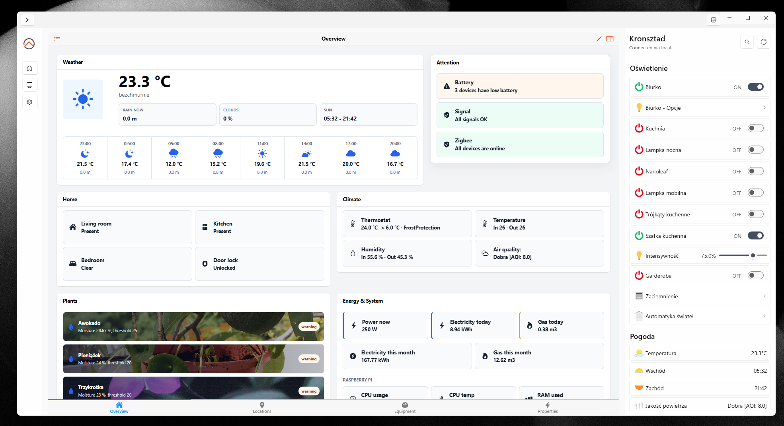
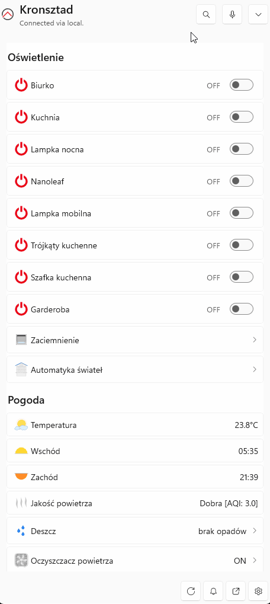
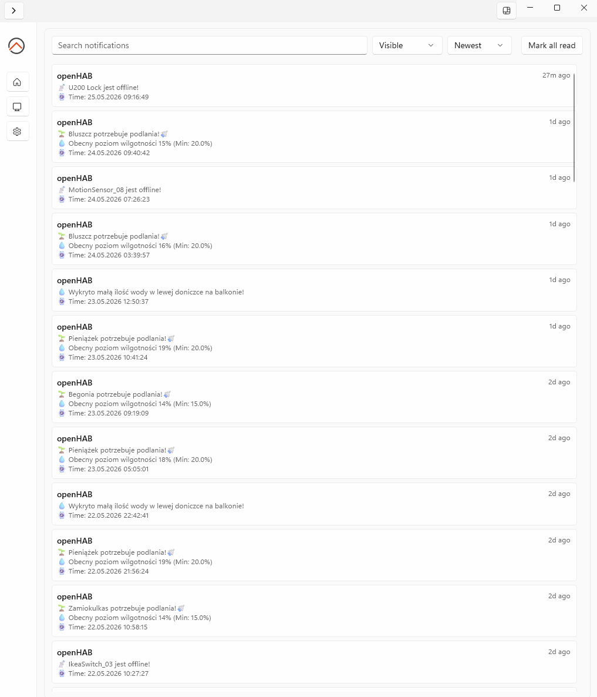

# openHAB Windows App Guide

The openHAB Windows app is a Windows 11 companion app for openHAB. It provides a tray flyout for quick sitemap control, a larger main window with embedded openHAB Main UI, Windows notifications, a command menu with global shortcuts, and optional Device Info Sync.

This guide describes how to configure and use the app. It is written for users of the Windows app, not for contributors working on the app source code.



## Requirements

- Windows 11.
- Microsoft Edge WebView2 Runtime for embedded openHAB Main UI.
- A reachable openHAB server.
- Optional: a myopenHAB account for cloud access and cloud notifications.

## Connection Setup

Open the app settings and configure the endpoints you want the app to use.

Typical local endpoint examples:

```text
http://192.168.1.3:8080
http://openhab:8080
```

Typical cloud endpoint:

```text
https://myopenhab.org
```

### Endpoint Mode

| Mode | Behavior |
| --- | --- |
| Automatic | The app tries the local endpoint first and uses the cloud endpoint if local access is unavailable. |
| Local only | The app uses only the local endpoint. |
| Cloud only | The app uses only the cloud endpoint. |

Automatic mode is usually the best choice for a laptop or tablet that is sometimes at home and sometimes away.

### Local API Token

If your openHAB server requires authentication for REST API access, create an API token in openHAB and enter it as the local API token in the app.

The app uses this token for local sitemap loading, Item commands, Device Info Sync, notification media that must be fetched from openHAB, and other local REST API calls.

For openHAB REST authentication details, see the [openHAB REST API documentation](https://www.openhab.org/docs/configuration/restdocs).

### Cloud Credentials

For myopenHAB access, enter your cloud endpoint, username or email address, and password in the app settings.

Cloud credentials are used for cloud endpoint access and cloud notification polling. If you choose Local only mode, new cloud notifications are not available.

## Tray Flyout And Main Window

The app has two main surfaces: the tray flyout and the main window.

### Tray Flyout

The tray flyout opens from the Windows tray and is meant for quick control. It uses the app's native sitemap renderer so common sitemap controls are available without opening the larger window.

The flyout currently does not host openHAB Main UI. Use the main window when you want the full Main UI experience.


### Main Window

The main window is for longer sessions and configuration. It contains:

- embedded openHAB Main UI through WebView2
- app Settings
- the Notifications page
- promoted Main UI pages discovered from openHAB
- an optional native sitemap pane

The optional sitemap pane can stay visible while you use Main UI, Settings, or Notifications.

For Main UI concepts, see the [openHAB Main UI documentation](https://www.openhab.org/docs/mainui/).

## Sitemaps

The Windows app can render openHAB sitemaps natively. Sitemaps are useful when you already use sitemap-based UIs or want a compact control surface in the tray flyout.

The app also adds Windows-specific navigation conveniences:

- breadcrumbs for subpage navigation
- sitemap search



For sitemap syntax and available sitemap element types, see the [openHAB Sitemaps documentation](https://www.openhab.org/docs/ui/sitemaps).

## Notifications

The app can show openHAB Cloud notifications as native Windows notifications when cloud access is configured. Notifications also appear in the app's Notifications page.



Notification features include:

- Windows toast notifications
- an in-app notification inbox
- search and filtering
- read and hidden states
- tags and reference IDs
- rich media when available
- action buttons
- log-only notifications
- hide and remove behavior from openHAB Cloud notification actions

New cloud notifications are unavailable in Local only mode. Use Automatic or Cloud only mode when you want the app to poll cloud notifications.

### Notification Actions

openHAB Cloud notifications can include click actions and up to three action buttons. The Windows app supports common action forms:

| Action | Result |
| --- | --- |
| `command:LivingRoom_Light:ON` | Sends `ON` to the `LivingRoom_Light` Item. |
| `ui:/` | Opens the openHAB UI start page in the app. |
| `ui:navigate:/page/my_page` | Navigates Main UI to the specified page when possible. |
| `https://www.openhab.org` | Opens the web link. |

The app stores notification history locally so you can review messages later. Log-only notifications appear in the inbox but do not show a Windows toast.

For openHAB Cloud notification actions, tags, reference IDs, media attachments, and hide actions, see the [openHAB Cloud Connector documentation](https://www.openhab.org/addons/integrations/openhabcloud/).

## Command Menu And Shortcuts

The app includes a command menu for actions you want to run quickly from Windows. The command menu is a radial menu opened by a configurable global shortcut.

You can configure an action to be available in one or both places:

- command menu only
- its own global shortcut only
- command menu and its own global shortcut

The command menu itself also has a configurable global shortcut.

Windows or another app may reserve or intercept some key combinations, especially some shortcuts that include the Windows key. If a shortcut cannot be registered, choose another combination in Settings.

Shortcuts can be configured while openHAB is disconnected. Running an action requires an active openHAB connection.


### Action Types

| Action type | What it does |
| --- | --- |
| Toggle | Reads an Item state and sends the opposite `ON` or `OFF` command when the state is known. |
| On / Off | Sends either `ON` or `OFF`. |
| Open / Close | Sends either `OPEN` or `CLOSE`. |
| Open slider | Opens a compact slider for a numeric or dimmer-style Item. |
| Open color picker | Opens a compact color picker for color-style Items. |
| Send command | Sends custom command text to the target Item. |
| Voice | Starts voice command mode when Voice Mode is enabled. |

Voice actions can appear in the shortcuts and actions list. They are controlled by Voice Mode settings, and behavior depends on Windows speech availability and app configuration.

### Examples

| Example action | Placement | Type |
| --- | --- | --- |
| Movie scene | Command menu and global shortcut | `Send command` to `MovieScene` with `ON` |
| Desk lamp | Command menu only | `Toggle` on `Desk_Lamp` |
| Volume | Command menu only | `Open slider` on `Media_Volume` |
| Listen | Command menu or global shortcut | `Voice`, when Voice Mode is enabled |

## Device Info Sync

Device Info Sync can send selected Windows device information to openHAB Items. It is opt-in.

No device information is sent until Device Info Sync is enabled and at least one signal is mapped to an Item. Each signal can be configured separately. A blank Item mapping disables that signal.

The device identifier is used to generate default Item names. For example, a device identifier of `Desk` produces names such as `DeskBatteryLevel` and `DeskWifiConnected`. You can edit every Item name.

The app sends Device Info Sync updates through the active openHAB connection. It does not use a separate server profile.

Sync can happen:

- after the app starts,
- on the configured interval,
- when Windows lock, resume, network, Bluetooth, or focus state changes are detected,
- when the openHAB connection state changes.

If a sync fails, the app records the result in status and diagnostics. A failed sync should not block sitemap browsing, commands, notifications, or other app use.

### Signals

| Signal | Typical openHAB Item | Values |
| --- | --- | --- |
| Battery level | `Number` | `0` to `100`, omitted when unavailable |
| Charging state | `Switch` | `ON` or `OFF` |
| Locked state | `Switch` | `ON` or `OFF` |
| Session state | `String` | `active`, `locked`, `sleep`, `resume`, `unknown` |
| Wi-Fi connected | `Switch` | `ON` or `OFF` |
| Wi-Fi name | `String` | SSID or `UNDEF` |
| Bluetooth connected | `Switch` | `ON` or `OFF` |
| Bluetooth device names | `String` | connected device names or `UNDEF` |
| openHAB connection | `String` | `online`, `degraded`, `offline`, `unknown` |
| Focus / DND | `Switch` or `String` | `ON`, `OFF`, or `UNSUPPORTED` |

### Example Items

These examples use `Desk` as the device identifier.

```java
Number DeskBatteryLevel "Desk battery [%d %%]"
Switch DeskChargingState "Desk charging"

Switch DeskLockedState "Desk locked"
String DeskSessionState "Desk session [%s]"

Switch DeskWifiConnected "Desk Wi-Fi connected"
String DeskWifiName "Desk Wi-Fi [%s]"

Switch DeskBluetoothConnected "Desk Bluetooth connected"
String DeskBluetoothDeviceNames "Desk Bluetooth devices [%s]"

String DeskOpenHabConnection "Desk openHAB connection [%s]"
String DeskFocusState "Desk focus state [%s]"
```

For Item syntax and Item types, see the [openHAB Items documentation](https://www.openhab.org/docs/configuration/items).

### Privacy

Device Info Sync sends only the signals you enable and map.

It does not send:

- Windows username,
- IP address,
- MAC address,
- Wi-Fi BSSID,
- openHAB credentials,
- API tokens.

Wi-Fi name and Bluetooth device names can reveal private information about your environment. Leave those mappings blank if you do not want them sent to openHAB.

## Appearance And Language

Appearance settings control how native app surfaces look.

Available settings include:

- sitemap skin selection,
- icon style,
- app theme behavior,
- language selection.

If you change the app language, some text may require an app restart before the new language is fully loaded.

## Privacy And Diagnostics

The app stores settings, notification history, and diagnostics locally under:

```text
%LocalAppData%\OpenHab.WinApp
```

Useful files include:

- `diagnostics.log`,
- `task-crash.log`,
- `settings.json`,
- `notifications.json`.

Diagnostics are intended to redact credentials, tokens, passwords, and sensitive endpoint details. Still, avoid posting full logs publicly. Logs can include private server data such as Item names, notification text, or other details from your openHAB setup.

## Troubleshooting

### The App Cannot Connect

Check that the endpoint URL is reachable from Windows. Local URLs usually look like `http://openhab:8080` or `http://192.168.1.3:8080`.

If Automatic mode fails at home, verify the local endpoint first. If Cloud only mode fails, verify your myopenHAB endpoint and credentials.

### Local API Token Problems

If local access requires authentication, verify that the token is current and was copied completely. In openHAB, API tokens are managed from the user profile in Main UI.

### Main UI Does Not Load

The main window uses WebView2 for embedded openHAB Main UI. If Main UI does not load:

- verify WebView2 Runtime is installed,
- try opening the same endpoint in a browser,
- verify cloud or local credentials,
- use the app's open-in-browser action if available.

### Notifications Do Not Appear

Cloud notifications require cloud credentials and a mode that allows cloud access. New cloud notifications are unavailable in Local only mode.

Also check Windows notification settings for the app. Windows can suppress notifications through Focus, Do Not Disturb, or per-app notification settings.

### A Shortcut Cannot Be Registered

Some shortcuts are reserved by Windows or already used by another app. This is especially common for some Windows-key combinations.

Choose a different shortcut in Settings. The app can save shortcut settings even while disconnected, but actions only run when openHAB is connected.

### Device Info Sync Does Not Update Items

Check that:

- Device Info Sync is enabled,
- each signal has the correct Item name,
- the target Items exist in openHAB,
- Item types match the values being sent,
- the active endpoint is connected,
- the app has a valid local token or cloud credentials for the selected endpoint mode.

Use the Device Info Sync status in Settings and `diagnostics.log` for more detail.

## Current Limitations

- The app is under active development and is not yet an official release-ready openHAB distribution.
- The tray flyout currently uses native sitemap rendering and does not host openHAB Main UI.
- Cloud notifications depend on cloud credentials and notification polling.
